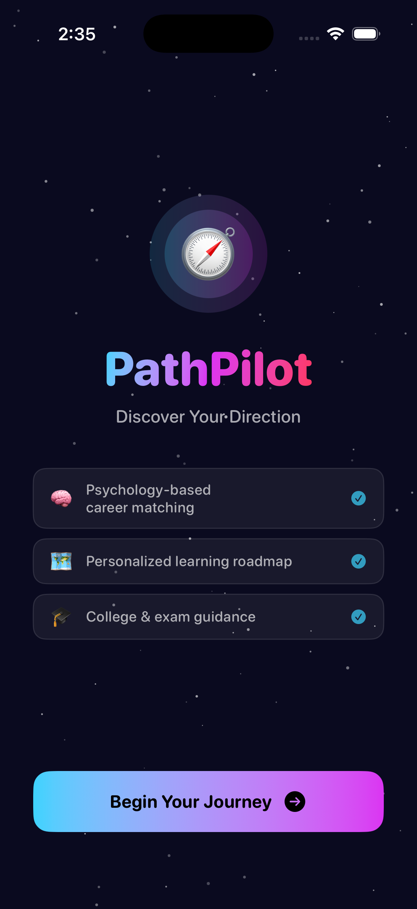
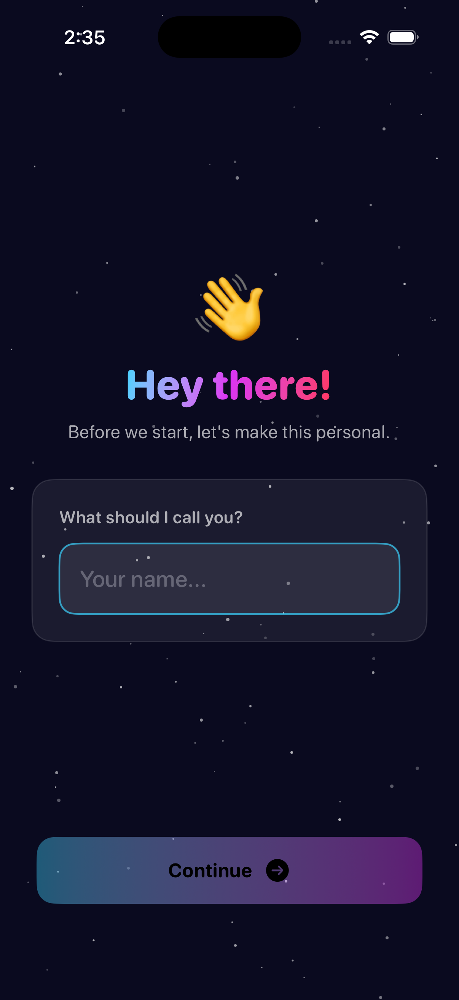
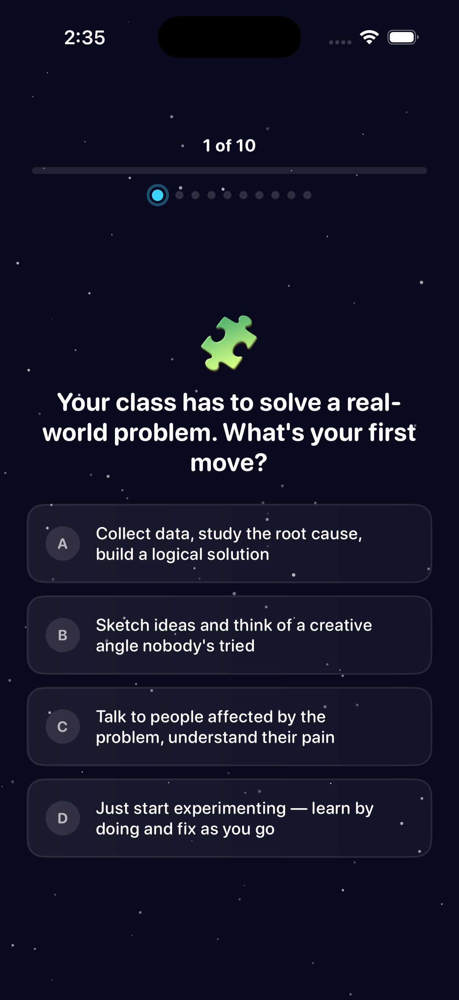

# 🧭 PathPilot — Psychology-Driven Offline Career Guidance App

> Swift Student Challenge Submission  
> Built entirely with SwiftUI · Fully Offline 

---

## 📌 Overview

**PathPilot** is a fully offline, psychology-based career guidance app designed to help students discover their ideal academic and professional paths.

The experience is structured into three intelligent phases:

1. **Input Phase** – Collects student name & subject preferences  
2. **Psychology Quiz** – 6 weighted MCQs build a personality profile  
3. **Results Engine** – Generates personalized career matches with roadmaps, salary ranges, and college guidance  

No APIs. No tracking. No internet dependency.  
All logic runs locally using Swift models and a custom scoring engine.

---

## 🏗 Architecture

PathPilot follows a lightweight **MVVM-inspired architecture** using a shared observable session model.

### Core Pattern

- `@StateObject` → Creates the single `AppSession`
- `@ObservedObject` → Injected into child views
- `AppScreen` enum → Controls navigation
- Static data models → Stored in `Data.swift`

### Why This Approach?

- Clean separation of responsibility  
- Reactive UI updates  
- Predictable state management  
- Playground-safe navigation control  

---

## 📂 File Structure

PathPilot
├── MyApp.swift
├── Models.swift
├── Data.swift
├── Theme.swift
├── ContentView.swift
├── WelcomeNameViews.swift
├── SubjectQuizViews.swift
├── ResultsView.swift
├── CareerDetailView.swift
└── ExtraToolsView.swift

Each file handles a single responsibility to mirror real-world iOS project organization.

---

## 🧠 Psychology & Scoring Engine

The intelligence of PathPilot lies in its **weighted trait matching system**.

### Step 1 — Personality Building

Each quiz answer contributes weighted points to 6 traits:

- 🔍 Analytical  
- 🎨 Creative  
- 🤝 Social  
- 🚀 Leadership  
- 🔧 Practical  
- 🔬 Research-Oriented  

Scores accumulate across 6 questions to form a personality distribution.

---

### Step 2 — Career Matching

Each career has a **unique trait weight fingerprint**.

Example:

- **Software Engineer**
  - High weight: Analytical, Practical
  - Low weight: Social

- **Psychologist**
  - High weight: Social, Research
  - Low weight: Practical

### Scoring Formula

Career Score =
(Subject Match × 5 per subject)
+
(Normalized Personality Score × Trait Weight × 10)
+
Small Random Tie-breaker

### Why It Works

- Results genuinely change based on answers  
- No two personalities produce identical rankings  
- Subject selection strongly influences outcomes  
- Scores are normalized to prevent bias  

---

## 🎯 Career Database

PathPilot includes **16 curated careers** across multiple domains:

- 💻 Technology  
- 🔬 Science & Research  
- 🏥 Health & Medicine  
- 💼 Business & Finance  
- 🎬 Creative & Arts  
- 🌍 Social & Environment  

Each career includes:

- 5-step roadmap (Beginner → Advanced)
- Required skills
- Timeline to first job
- Salary range (₹ + $)
- Recommended college types
- Entrance exams
- Scholarship awareness tips

---

## 🎨 UI & Design System

All design tokens are centralized in `Theme.swift`.

### Design Language

- Dark-first aesthetic
- Cyan → Purple gradient accents
- Glassmorphism cards
- Spring-based animations
- Animated starfield background

### Reusable Modifiers

- `GlassCard`
- `PrimaryButtonStyle`
- `AnimatedProgressBar`
- `PersonalityChartView`

---

## ✨ Key SwiftUI Concepts Used

- `@StateObject`
- `@ObservedObject`
- `@Binding`
- `@FocusState`
- `LazyVGrid`
- `GeometryReader`
- `ScrollView`
- Custom `ViewModifier`
- Enum-based navigation
- Asymmetric `.transition()`
- Spring animations

---

## 📊 Feature Breakdown

### 🧭 Onboarding
Animated welcome screen with gradient typography and feature highlights.

### 📚 Subject Selection
3-column `LazyVGrid` with animated selectable subject cards.

### 🧠 Personality Quiz
- Animated progress bar
- Step indicators
- Back navigation with score reversal logic
- Weighted answer scoring

### 📈 Results Dashboard
- Ranked career matches
- Personality trait bar chart
- Bookmarking system
- Motivational quote generator

### 🔎 Career Deep Dive
Tabbed interface:
- Roadmap
- College Guidance
- Skills Tracker

### 🛠 Extra Tools
- Goal Tracker
- Auto-generated 30-Day Starter Plan
- Career Comparison
- Full Personality Profile

---

## 🔒 Why Fully Offline?

- Instant load times  
- No API keys required  
- No privacy concerns  
- Stable in Swift Playgrounds sandbox  
- Perfect for student challenge constraints  

All data is defined in static Swift arrays.

---

## 🚀 Performance Considerations

- `LazyVGrid` for memory efficiency  
- Precomputed star background (no re-randomization)  
- Lightweight enum navigation  
- No third-party frameworks  

---

## 🧩 Extensibility

The architecture allows easy expansion:

- More quiz questions  
- Expanded career database  
- Local persistence  
- Regional college datasets  
- Future AI-powered insight engine  

---

## 🏁 Conclusion

PathPilot transforms career confusion into structured clarity.

It combines:

- Psychology
- Data modeling
- UX design
- Algorithmic scoring
- Offline-first engineering

All within a polished SwiftUI experience.

---

### 🧭 Built for the Swift Student Challenge  
**Fully Offline · Psychology-Based · Intelligent · Student-Centric**

## 📸 App Screenshots

